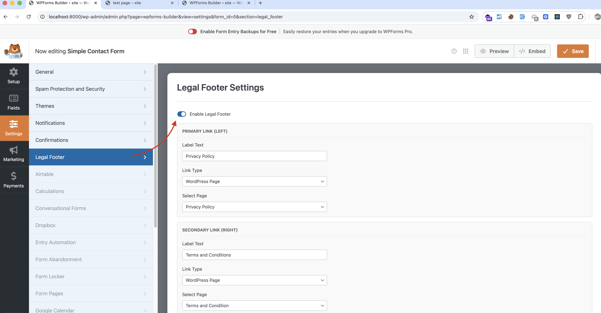

# 📝 WPForms Legal Footer

**Add professional "Teams and Conditions" and "Privacy Policy" links under your WPForms submit buttons with smart auto-detection.**

[](https://wordpress.org/plugins/)
[]()
[]()

---

## 🚀 Why this plugin?
Adding legal text links (like GDPR terms or Privacy Policies) directly under a submit button usually requires hacking functions.php or adding custom HTML. 

**WPForms Legal Footer** solves this by adding a **native "Legal Footer" tab** inside the WPForms Builder. It feels 100% official and requires zero coding.



## ✨ Features

- **🤖 Smart Auto-Detection:** Automatically scans your site for "Privacy" and "Terms" pages and pre-selects them to save you time.
- **🔗 Dual Link Support:** Add a Primary Link (Left) and a Secondary Link (Right).
- **🎨 Visual Customization:** 
    - Full color control.
    - Adjustable font size (default 12px).
    - Alignment options (Left, Center, Right).
    - Toggle Bold text.
- **🔒 Conditional Loading:** Assets only load when the footer is enabled for a specific form.
- **✅ Native UI:** Integrates deeply into `WPForms > Builder > Settings`.

## 📦 Installation

1.  Download the plugin zip or clone this repository into `wp-content/plugins/`.
    ```bash
    cd wp-content/plugins/
    git clone https://github.com/iamOmarFaruk/wpforms-legal-footer.git
    ```
2.  Activate **WPForms Legal Footer** via the WordPress Plugins menu.
3.  Open any WPForm in the Builder.
4.  Go to **Settings > Legal Footer**.
5.  Toggle **"Enable Legal Footer"**.

## 🤝 Contributing

Contributions are welcome! Please feel free to submit a Pull Request.

## 👨‍💻 Author

**Omar Faruk**  
*Expert Web Developer*

- 🌐 [Portfolio](https://omarfaruk.dev/)
- 🐙 [GitHub](https://github.com/iamOmarFaruk)
- 💼 [LinkedIn](https://www.linkedin.com/in/omar-expert-webdeveloper/)

---
*This plugin is not affiliated with WPForms.*
